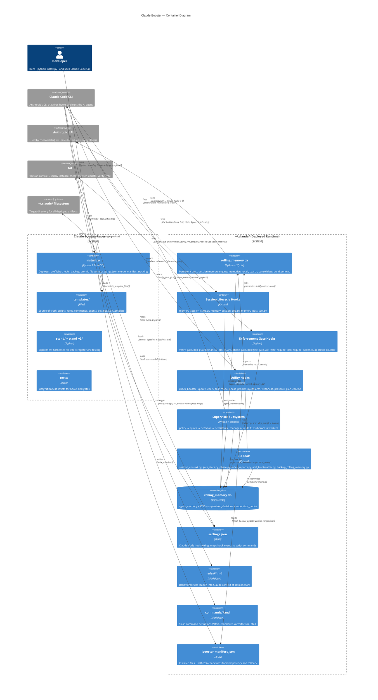
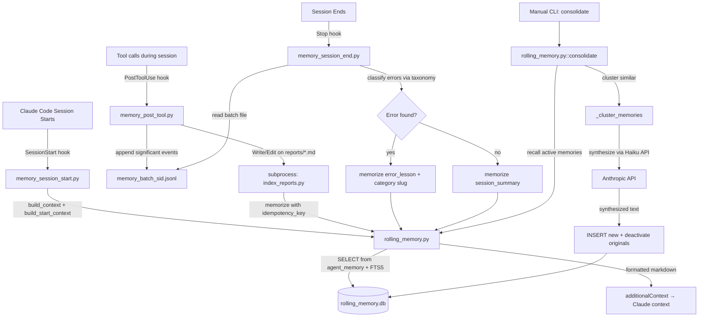
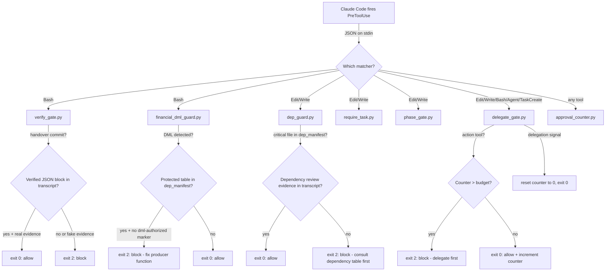
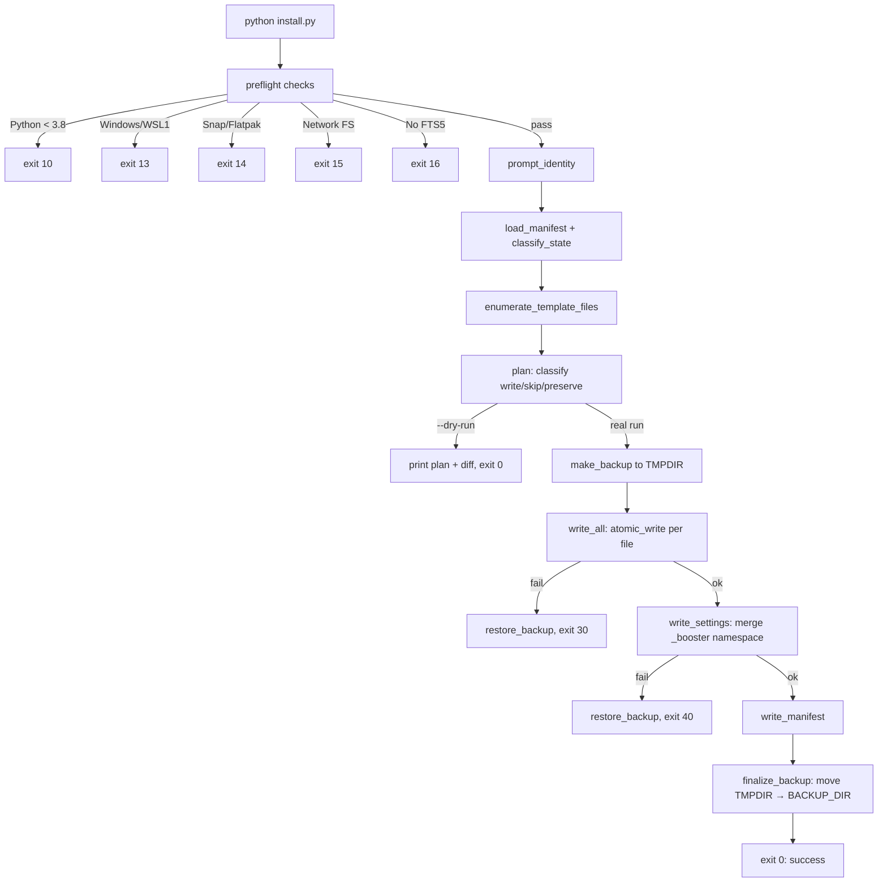
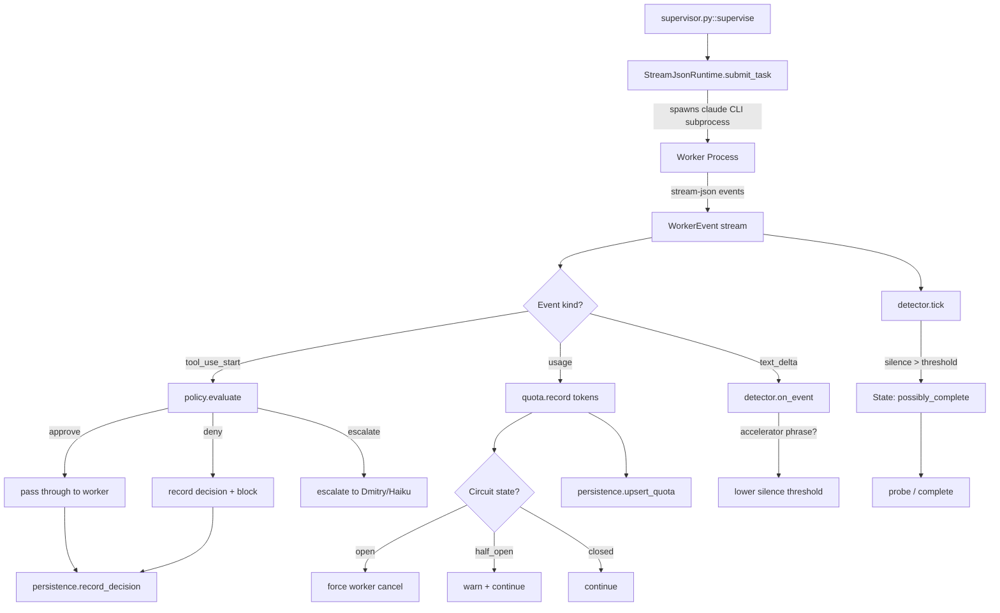

<!--
  ARCHITECTURE.md — Circuit Board Document
  Version:  1.0.0
  Date:     2026-05-05
  Session:  generated by /architecture — update with commit SHA
  Author:   generated by /architecture command
  RULE: This file is the "circuit board" of the system.
  Every connection between components is explicit here.
  When code changes, this file changes in the SAME COMMIT.
  A PR that rewires a dependency without updating this doc is a defect.
-->

# Architecture: Claude Booster

## The Circuit Board Contract

Claude Booster is a self-installing configuration system for Claude Code CLI that deploys persistent memory, enforcement hooks, slash commands, agent protocols, and a supervisor subsystem into `~/.claude/`. Its key invariant is **atomic deployment with rollback**: every install either completes fully (all files + settings.json merged + manifest written) or rolls back to the pre-install backup — no partial state.

**If you are adding a new dependency:** add a row to the Dependency Table and an edge to the Container Diagram before merging.

---

## C4 Level 2 — Container Diagram

---

## Dependency Table

| Component | Reads from | Writes to | Called by | Breaks if changed |
|---|---|---|---|---|
| `install.py::main()` | templates/, VERSION, git tags, .booster-manifest.json, .booster-config.json, settings.json | ~/.claude/scripts/*, rules/*, commands/*, agents/*, settings.json, .booster-manifest.json, backups/*.tar.gz | User CLI invocation | All deployed hooks, rules, commands — everything downstream |
| `install.py::write_settings()` | settings.json.template, existing settings.json | settings.json | install.py::main() | All hook dispatch — wrong wiring = silent hook failures |
| `install.py::atomic_write()` | n/a | Any target file via tmp+fsync+os.replace | install.py::write_all(), write_settings(), write_manifest() | Data integrity — partial writes corrupt hooks/rules |
| `rolling_memory.py::memorize()` | agent_memory (dedup check via content_hash) | db:agent_memory, db:agent_memory_fts (trigger) | memory_session_end.py, index_reports.py, consolidate(), CLI | Memory ingestion — broken = no cross-session learning |
| `rolling_memory.py::memorize_with_merge()` | db:agent_memory (via _find_similar FTS5) | db:agent_memory | memory_session_end.py | Compounding — broken = duplicate memories proliferate |
| `rolling_memory.py::recall()` | db:agent_memory | db:agent_memory (touch access_count, last_accessed_at) | consolidate(), build_context(), CLI | Memory retrieval — broken = empty /start context |
| `rolling_memory.py::search()` | db:agent_memory_fts JOIN agent_memory | n/a (read-only) | CLI, build_start_context() | FTS search — broken = /start knowledge base missing |
| `rolling_memory.py::consolidate()` | db:agent_memory, Anthropic API (Haiku) | db:agent_memory (insert synthesized, deactivate originals) | CLI invocation | Memory compaction — broken = unbounded memory growth |
| `rolling_memory.py::build_context()` | db:agent_memory | n/a (read-only) | memory_session_start.py | Session context injection — broken = no memory at session start |
| `rolling_memory.py::build_start_context()` | db:agent_memory (consilium/audit rows) | n/a (read-only) | memory_session_start.py, CLI | Knowledge base for /start — broken = no institutional knowledge |
| `memory_session_start.py::main()` | stdin (Claude Code JSON), db:agent_memory | stdout (additionalContext JSON) | Claude Code SessionStart hook | Session initialization — broken = no memory injection |
| `memory_session_end.py::main()` | stdin (JSON), memory_batch_{sid}.jsonl, transcript | db:agent_memory (error_lessons, session_summary) | Claude Code Stop hook | Error extraction — broken = no learning from failures |
| `memory_post_tool.py::main()` | stdin (PostToolUse JSON) | memory_batch_{sid}.jsonl, subprocess→index_reports.py | Claude Code PostToolUse hook | Event batching — broken = session_end has no data |
| `verify_gate.py::main()` | stdin (PreToolUse JSON), transcript, git diff | exit code 0/2, stderr | Claude Code PreToolUse/Bash hook | Handover verification — broken = unverified commits pass |
| `dep_guard.py::main()` | stdin (PreToolUse JSON), dep_manifest.json, transcript | exit code 0/2, stderr | Claude Code PreToolUse/Edit\|Write hook | Dependency review enforcement — broken = critical files edited without review |
| `financial_dml_guard.py::main()` | stdin (PreToolUse JSON), dep_manifest.json | exit code 0/2, stderr | Claude Code PreToolUse/Bash hook | DML protection — broken = direct data patches on protected tables |
| `delegate_gate.py::main()` | stdin (PreToolUse JSON), .delegate_counter, .delegate_mode | exit code 0/2, stderr, logs/delegate_gate_decisions.jsonl | Claude Code PreToolUse/Edit\|Write\|Bash\|Agent\|TaskCreate hook | Delegation enforcement — broken = Lead does work instead of delegating |
| `supervisor.py::Supervisor.supervise()` | WorkerRuntime events, PolicyContext | db:supervisor_decisions, db:supervisor_quota | CLI /supervise command | Worker management — broken = uncontrolled subprocess execution |
| `policy.py::evaluate()` | tool name, tool_input, PolicyContext | Decision (approve/escalate/deny) | supervisor.py::Supervisor | Tool approval policy — broken = wrong tier classification |
| `quota.py::QuotaTracker` | token counts | circuit_state (closed/half_open/open) | supervisor.py::Supervisor | Token budgeting — broken = self-deadlock on shared quota |
| `detector.py::WorkerStateDetector` | WorkerEvent stream | State FSM transitions | supervisor.py::Supervisor | Completion detection — broken = stuck workers or premature termination |
| `index_reports.py::main()` | ~/Projects/*/reports/*.md (filesystem walk) | db:agent_memory (via rolling_memory.memorize) | memory_post_tool.py (fire-and-forget), CLI | Report indexing — broken = /start misses consilium/audit knowledge |
| `session_context.py::main()` | session JSONL files, subagent JSONLs | stdout (readable/JSON) | paired-verification Worker/Verifier briefs | Session history extraction — broken = retry agents lose predecessor context |
| `check_booster_update.py::main()` | .booster-manifest.json, git fetch | stdout (additionalContext with update notice) | Claude Code SessionStart hook | Version drift detection — broken = stale installs go unnoticed |
| `arch_freshness.py::main()` | stdin (PostToolUse JSON), ARCHITECTURE.md mtime, transcript | stderr (warning) | Claude Code PostToolUse hook | Architecture staleness warning — broken = silent doc drift |

---

## Data Flows

### Memory Lifecycle: Ingest → Store → Retrieve → Consolidate

### Hook Gate Decision Flow

### Install Pipeline

### Supervisor Event Loop

---

## Invariants

| ID | Invariant | Checked by | On violation |
|---|---|---|---|
| INV-01 | agent_memory.content_hash is unique per (memory_type, content_hash) — no duplicate memories | `idx_memory_dedup` UNIQUE index WHERE content_hash IS NOT NULL | sqlite3.IntegrityError → rollback, skip silently |
| INV-02 | agent_memory.idempotency_key is unique — session_summary upsert replaces, never duplicates | `idx_idempotency_key` UNIQUE index WHERE idempotency_key IS NOT NULL | sqlite3.IntegrityError → rollback |
| INV-03 | agent_memory.priority in [0, 100] | CHECK(priority BETWEEN 0 AND 100) | DB rejects INSERT/UPDATE |
| INV-04 | agent_memory.status in ('active', 'under_review', 'superseded') | CHECK + Python validation in memorize() | ValueError raised before DB write |
| INV-05 | status='under_review' requires resolve_by_date (ISO YYYY-MM-DD) | memorize() validation | ValueError: "status='under_review' requires a resolve_by_date" |
| INV-06 | superseded_by_id only valid when status='superseded' | memorize() validation | ValueError: "superseded_by_id is only valid when status='superseded'" |
| INV-07 | supervisor_decisions.decision in ('approve', 'escalate', 'deny') | CHECK constraint + persistence.py validation | ValueError + DB CHECK rejection |
| INV-08 | supervisor_decisions.approved_by in ('regex', 'haiku', 'dmitry') or NULL | CHECK constraint + persistence.py validation | ValueError + DB CHECK rejection |
| INV-09 | supervisor_quota.circuit_state in ('closed', 'half_open', 'open') | CHECK constraint + QuotaTracker.state property | DB CHECK rejection |
| INV-10 | consolidate() is atomic: insert synthesized FIRST, then deactivate originals | BEGIN IMMEDIATE transaction in consolidate() | Rollback on any error — originals stay active, no data loss |
| INV-11 | consolidate(scope='all') is forbidden — prevents cross-project memory merging | Explicit ValueError guard | ValueError: "consolidate(scope='all') is unsafe" |
| INV-12 | preserve=1 rows immune to consolidate() | Filter in consolidate() before clustering | Preserved rows excluded from cluster input |
| INV-13 | install.py writes are atomic: tmp file + fsync + os.replace | atomic_write() implementation | On failure: tmp file cleaned up, no partial target |
| INV-14 | Install either fully succeeds or rolls back to backup | main() try/except with restore_backup() | Backup restored on write failure (exit 30) or settings failure (exit 40) |
| INV-15 | gate hooks exit 0 (allow), 2 (block), or 1 (fail-open) — never crash Claude | try/except in every hook main() | Errors logged, exit 0 or 1 — never block on programming error |
| INV-16 | Delegate gate budget: Lead gets at most 1 action tool call before must delegate | .delegate_counter state file + budget check | exit 2: block with "delegate first" message |
| INV-17 | QuotaTracker reserves 15% for supervisor control traffic | reserve_pct=0.15, thresholds at 50%/85% | Circuit opens at 85% — worker cancelled |

---

## Protected Paths

### Derived / Read-Only Columns

| Column | Owner function | How it's computed |
|---|---|---|
| agent_memory.content_hash | rolling_memory._content_hash() | SHA-256 of content.strip().encode() |
| agent_memory.access_count | rolling_memory.recall(touch_access=True) | Incremented on each recall() call |
| agent_memory.last_accessed_at | rolling_memory.recall(touch_access=True) | Set to strftime('%Y-%m-%dT%H:%M:%SZ','now') on recall |
| supervisor_quota.circuit_state | QuotaTracker.state property | Computed from usage_pct vs thresholds |

### Append-Only Tables

<!-- Not applicable: no append-only tables enforced at the DB level. The
     `agent_memory` table supports soft-delete (active=0) and UPDATE for
     access tracking. `supervisor_decisions` is effectively append-only
     by design (no UPDATE/DELETE in code) but not enforced by constraint. -->

| Table | Written by | Why append-only |
|---|---|---|
| supervisor_decisions | SupervisorPersistence.record_decision() | Audit trail of all supervisor approve/escalate/deny decisions — no UPDATE/DELETE in codebase |

---

## Update Log

| Date | Commit | Change description | Author |
|---|---|---|---|
| 2026-05-05 | generated | Initial architecture document from /architecture command | generated |
