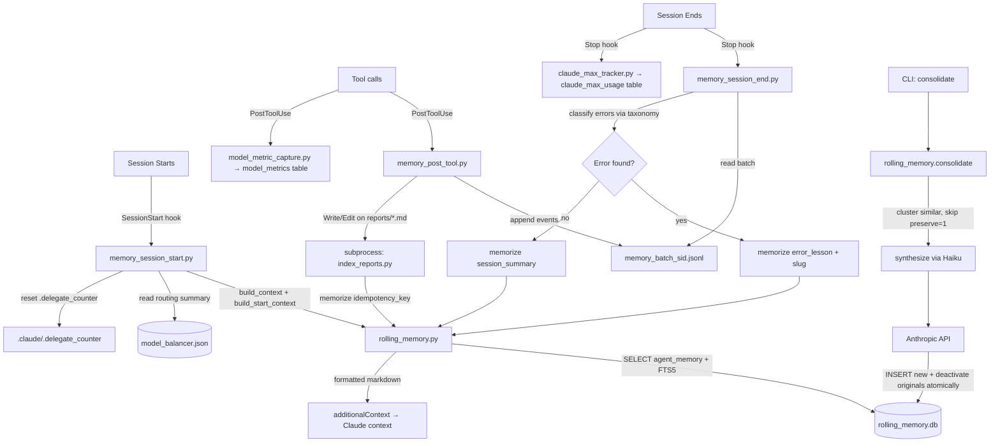
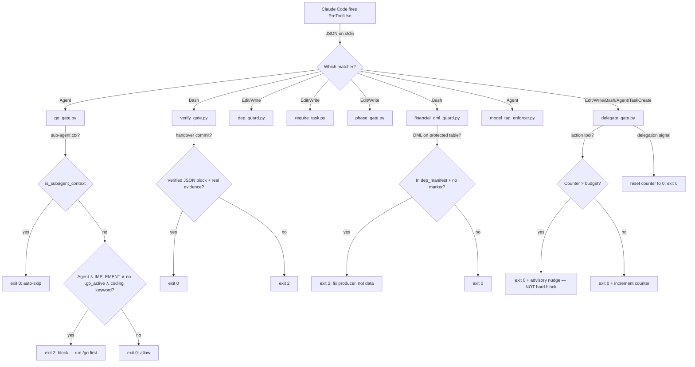
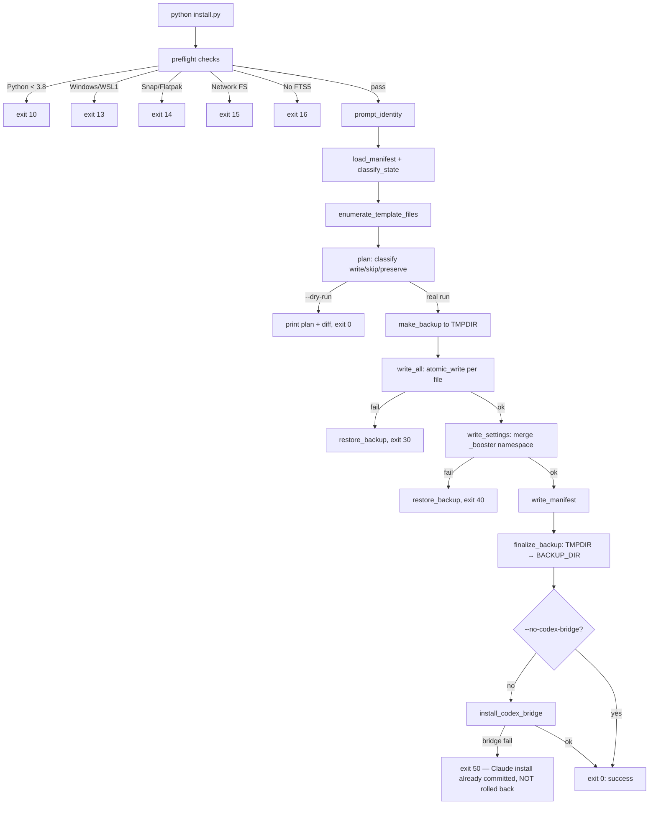
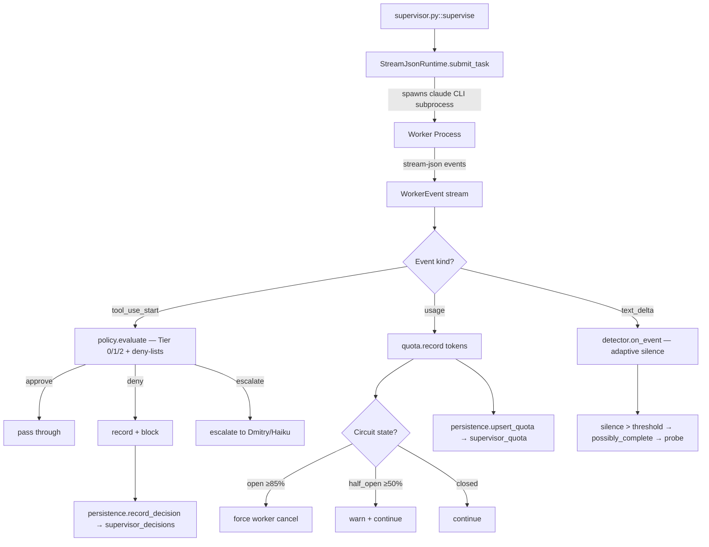

<!--
  ARCHITECTURE.md — Circuit Board Document
  Version:  1.1.0
  Date:     2026-06-13
  Session:  generated by /architecture --update (diff-update mode)
  Author:   generated by /architecture command
  RULE: This file is the "circuit board" of the system.
  Every connection between components is explicit here.
  When code changes, this file changes in the SAME COMMIT.
  A PR that rewires a dependency without updating this doc is a defect.
-->

# Architecture: Claude Booster

## The Circuit Board Contract

Claude Booster is a self-installing **Python 3.11 tooling system** for the Claude Code CLI (and, via the Codex bridge, the Codex CLI) that deploys persistent memory, enforcement hooks, slash commands, a model-routing balancer, agent protocols, and a supervisor subsystem into `~/.claude/`. It is **not** a web app — there is no HTTP framework and no ORM. Persistent state lives in three places: the SQLite `rolling_memory.db` (FTS5, schema v8), the per-day routing file `~/.claude/model_balancer.json`, and append-only JSONL logs under `~/.claude/logs/`.

Its key invariant is **atomic deployment with rollback**: every install either completes fully (all files + settings.json merged + manifest written) or rolls back to the pre-install backup — no partial state. The Codex bridge is installed in an **isolated phase (exit 50)** so its failure never rolls back the committed Claude install.

**If you are adding a new dependency:** add a row to the Dependency Table and an edge to the Container Diagram before merging.

---

## C4 Level 2 — Container Diagram

```mermaid
C4Container
    title Claude Booster — Container Diagram

    Person(user, "Developer", "Runs `python install.py` and uses Claude Code / Codex CLI")

    System_Boundary(booster_repo, "Claude Booster Repository") {
        Container(installer, "install.py", "Python 3.11 stdlib", "Deployer: preflight, backup, atomic writes, settings.json merge, manifest, Codex bridge (exit-50 isolated)")
        Container(templates, "templates/", "Files", "Source of truth: scripts, rules, commands, agents, codex/ bridge assets, settings.json.template")
        Container(stand, "stand/ + stand_v3/", "Python", "Experiment harnesses for affect-register A/B testing")
        Container(tests, "tests/", "Bash", "Integration test scripts for hooks and gates")
    }

    System_Boundary(claude_home, "~/.claude/ (Deployed Runtime)") {
        Container(rolling_memory, "rolling_memory.py", "Python + SQLite", "Memory engine: memorize, recall, search, consolidate, build_context (schema v8)")
        Container(balancer, "model_balancer.py", "Python", "Daily routing decision per task-category: anthropic | codex-cli | pal; pinned categories")
        Container(session_hooks, "Session Lifecycle Hooks", "Python", "memory_session_start, memory_session_end, memory_post_tool, model_metric_capture, claude_max_tracker, compact_advisor(+inject)")
        Container(gate_hooks, "Enforcement Gate Hooks", "Python", "go_gate, verify_gate, dep_guard, financial_dml_guard, phase_gate, delegate_gate, ask_gate, require_task, model_tag_enforcer, approval_counter")
        Container(supervisor, "Supervisor Subsystem", "Python + asyncio", "policy → quota → detector → persistence; manages claude CLI subprocess workers; behind /lead")
        Container(cli_tools, "CLI Tools", "Python", "session_context, kpi_rework, gate_stats, phase, index_reports, telemetry_agent_health, add_frontmatter, backup_rolling_memory")
        ContainerDb(sqlite_db, "rolling_memory.db", "SQLite WAL (v8)", "agent_memory + FTS5 + model_metrics + claude_max_usage + supervisor_decisions + supervisor_quota")
        Container(balancer_json, "model_balancer.json", "JSON", "Per-day routing state; pinned categories; scheduled_changes; transitions")
        Container(jsonl_logs, "logs/*.jsonl", "Append-only JSONL", "go_gate, delegate_gate, ask_gate, financial_dml, kpi_rework, model_metric_capture, compact_advisor, gate_bypass")
        Container(markers, "Per-project .claude/ markers", "Files", ".phase, .go_active, .delegate_counter, .compact_recommended_<sid>")
        Container(settings, "settings.json", "JSON", "Claude Code hook wiring: maps hook events to script commands (_booster namespace)")
        Container(rules, "rules/*.md", "Markdown", "Behavioral rules loaded into Claude context at session start")
        Container(commands, "commands/*.md", "Markdown", "Slash command definitions (/go, /start, /handover, /architecture, …)")
        Container(manifest, ".booster-manifest.json", "JSON", "Installed files + SHA-256 checksums for idempotency and rollback")
    }

    System_Boundary(codex_home, "Codex Bridge Targets") {
        Container(codex_skills, "~/.agents/skills/ + ~/.codex/prompts/", "Files", "Mirrored Booster commands as Codex skills/prompts + booster-command compatibility skill")
        Container(bridge_manifest, "~/.codex/claude-booster-bridge-manifest.json", "JSON", "Bridge install record + SHA-256 (separate from main manifest)")
    }

    System_Ext(claude_cli, "Claude Code CLI", "Anthropic's CLI that fires hooks and runs the AI agent")
    System_Ext(codex_cli, "Codex CLI", "OpenAI codex binary; Worker/audit provider via codex_worker.sh + codex_sandbox_worker.sh")
    System_Ext(anthropic_api, "Anthropic API", "consolidate() Haiku synthesis + token counting (Anthropic SDK)")
    System_Ext(pal_mcp, "PAL MCP", "External second-opinion/audit provider (gpt-5.5) for audit_external category")
    System_Ext(zai_api, "Z.ai API", "Anthropic-compatible GLM-5.2 endpoint for third-model read-only review")
    System_Ext(grok_cli, "Grok CLI", "xAI Grok Build CLI; fourth-model review and sandboxed code worker")
    System_Ext(git, "Git", "Version control: installer, check_booster_update, verify_gate, codex_sandbox worktree")
    System_Ext(filesystem, "~/.claude/ filesystem", "Target directory for all deployed artifacts")

    Rel(user, installer, "runs", "python install.py [--dry-run] [--yes] [--no-codex-bridge]")
    Rel(installer, templates, "reads", "enumerate_template_files()")
    Rel(installer, filesystem, "writes", "atomic_write() via tmp+fsync+os.replace")
    Rel(installer, manifest, "writes", "write_manifest()")
    Rel(installer, settings, "merges", "merge_settings() — _booster namespace")
    Rel(installer, codex_skills, "installs", "install_codex_bridge() (exit-50 isolated)")
    Rel(installer, bridge_manifest, "writes", "_bridge_write_manifest()")
    Rel(installer, git, "reads", "git describe --tags, git config")

    Rel(claude_cli, settings, "reads", "hook event dispatch")
    Rel(claude_cli, session_hooks, "fires", "SessionStart, PostToolUse, Stop, UserPromptSubmit")
    Rel(claude_cli, gate_hooks, "fires", "PreToolUse (Bash, Edit, Write, Agent, TaskCreate)")
    Rel(claude_cli, rules, "loads", "context injection at session start")
    Rel(claude_cli, commands, "loads", "slash command definitions")

    Rel(session_hooks, rolling_memory, "calls", "memorize, build_context, build_start_context")
    Rel(session_hooks, sqlite_db, "reads/writes", "agent_memory, model_metrics, claude_max_usage")
    Rel(session_hooks, balancer_json, "reads", "memory_session_start injects routing summary")
    Rel(gate_hooks, sqlite_db, "reads", "dep_manifest lookup, transcript scan")
    Rel(gate_hooks, markers, "reads/writes", ".phase, .go_active, .delegate_counter")
    Rel(gate_hooks, jsonl_logs, "appends", "fail-soft telemetry per decision")
    Rel(rolling_memory, sqlite_db, "reads/writes", "agent_memory + agent_memory_fts + model_metrics")
    Rel(rolling_memory, anthropic_api, "calls", "consolidate() → claude-haiku-4-5; token counting")

    Rel(balancer, sqlite_db, "reads", "model_metrics 14-day p50 latency")
    Rel(balancer, balancer_json, "writes", "decide() atomic; pinned categories preserved")
    Rel(balancer, pal_mcp, "routes", "audit_external → gpt-5.5")
    Rel(balancer, zai_api, "routes", "audit_secondary / hackathon_external → glm-5.2[1m] via zai_cli.py")
    Rel(balancer, grok_cli, "routes", "audit_tertiary → grok-composer-2.5-fast; hackathon_coder → grok-build")
    Rel(balancer, codex_cli, "routes", "coding/hard → codex-cli gpt-5.5 (pinned)")

    Rel(supervisor, sqlite_db, "reads/writes", "supervisor_decisions + supervisor_quota")
    Rel(supervisor, claude_cli, "spawns", "headless subprocess via stream-json")
    Rel(codex_skills, codex_cli, "consumed by", "Codex CLI reads mirrored skills/prompts")
```



---

## Dependency Table

| Component | Reads from | Writes to | Called by | Breaks if changed |
|---|---|---|---|---|
| `install.py::main()` | templates/, VERSION, git tags, .booster-manifest.json, settings.json | ~/.claude/scripts/*, rules/*, commands/*, agents/*, settings.json, .booster-manifest.json, backups/*.tar.gz | User CLI invocation | All deployed hooks, rules, commands — everything downstream |
| `install.py::write_settings()` / `merge_settings()` | settings.json.template, existing settings.json | settings.json | install.py::main() | All hook dispatch — wrong wiring = silent hook failures |
| `install.py::atomic_write()` | n/a | Any target file via tmp+fsync+os.replace | write_all(), write_settings(), write_manifest(), bridge writes | Data integrity — partial writes corrupt hooks/rules |
| `install.py::install_codex_bridge()` | templates/codex/{skills,prompts}, templates/commands/*.md, ~/.codex/...bridge-manifest.json | ~/.agents/skills/*, ~/.codex/prompts/*, booster-command/references/commands/*, bridge manifest | install.py::main() | Codex CLI loses Booster commands. **Exit-50 isolated: failure does NOT roll back Claude install.** Path-traversal guard (`_within_managed_roots`) protects stale removal |
| `rolling_memory.py::memorize()` | db:agent_memory (dedup via content_hash) | db:agent_memory, db:agent_memory_fts (trigger) | memory_session_end, index_reports, consolidate(), memorize_with_merge, CLI | Memory ingestion — broken = no cross-session learning |
| `rolling_memory.py::recall()` / `search()` | db:agent_memory, db:agent_memory_fts | db:agent_memory (touch access_count) on recall | consolidate(), build_context(), build_start_context(), CLI | Retrieval — broken = empty /start context / no FTS knowledge base |
| `rolling_memory.py::consolidate()` | db:agent_memory, Anthropic API (Haiku) | db:agent_memory (insert synthesized, deactivate originals) | CLI | Memory compaction — broken = unbounded growth. scope='all' forbidden; preserve=1 immune |
| `rolling_memory.py::init_db()` | db PRAGMA user_version | CREATE/ALTER/INDEX/TRIGGER (schema v8) | get_connection() path | Schema migration — atomic FTS migration in BEGIN IMMEDIATE; broken = corrupt DB |
| `model_balancer.py::decide()` | model_balancer.json, db:model_metrics (14-day p50), openai_models.json | model_balancer.json (atomic), rolling .bak (max 7) | SessionStart hook, `model_balancer.py decide` CLI | Routing — broken = wrong provider/model per category. Pinned {lead, high_blast_radius, coding, hard} never overwritten by active scorer |
| `model_balancer.py::get_routing()` | model_balancer.json (cached) | n/a | memory_session_start, supervisor runtime, delegating Lead | Routing reads — broken = agents fall back to static tier map |
| `zai_cli.py::main()` | stdin prompt, ZAI_API_KEY env, Claude Code CLI | stdout model response | `/audit`, `/consilium`, `/go`, `/hackathon` external-review fallback | Third-model review — broken = PAL fallback collapses to same-provider review; must never persist API keys |
| `grok_cli.py::main()` | stdin prompt, Grok CLI auth/config | stdout model response, model_metrics row | `/audit`, `/hackathon`, `/go` external-review fallback | Fourth-model review — broken = provider diversity drops to PAL/Z.ai only |
| `grok_sandbox_worker.sh` | stdin task, git repo, Grok CLI auth/config | stdout unified diff from isolated worktree | `/hackathon`, `/go` write-capable Grok contestant | Grok coding lane — broken = no fourth-provider code worker; must not write directly to main checkout |
| `model_metric_capture.py::main()` | stdin (PostToolUse JSON), tool_response.usage | db:model_metrics, logs/model_metric_capture_sample.jsonl | Claude Code PostToolUse hook | Balancer starvation — broken = no latency/token telemetry → passive routing forever |
| `claude_max_tracker.py::main()` | stdin (Stop/usage JSON) | db:claude_max_usage (INSERT OR REPLACE) | Claude Code Stop hook | Weekly-max feed — broken = `_get_weekly_max_pct()` blind, balancer can't throttle |
| `go_gate.py::main()` | stdin (PreToolUse JSON), .phase, .go_active marker | exit 0/2, logs/go_gate_decisions.jsonl | Claude Code PreToolUse/Agent hook | /go pipeline enforcement — broken = Worker spawns bypass Flow Designer→Verifier in IMPLEMENT |
| `kpi_rework.py::{record,report}` | logs/kpi_rework.jsonl, CLI args | logs/kpi_rework.jsonl (append) | go.md Phase 4, start.md telemetry, CLI | Rework KPI blind — broken = no first-pass-clean / worker-spawn / defect-category tracking |
| `model_tag_enforcer.py::main()` | stdin (Agent PreToolUse JSON), model_balancer.json | exit 0/2, stderr advisory | Claude Code PreToolUse/Agent hook | Routing drift — broken = Agent spawns ignore balancer; blocks only Anthropic tier mismatch |
| `verify_gate.py::main()` | stdin (PreToolUse JSON), transcript, git diff | exit 0/2, logs/verify_gate_decisions.jsonl | Claude Code PreToolUse/Bash hook | Handover verification — broken = unverified commits pass |
| `dep_guard.py::main()` | stdin (PreToolUse JSON), dep_manifest.json, transcript | exit 0/2, logs | Claude Code PreToolUse/Edit\|Write hook | Critical-file edit guard — broken = critical files edited without review |
| `financial_dml_guard.py::main()` | stdin (PreToolUse JSON), dep_manifest.json | exit 0/2, logs/financial_dml_guard_decisions.jsonl | Claude Code PreToolUse/Bash hook | DML protection — broken = direct data patches on protected tables |
| `delegate_gate.py::main()` | stdin (PreToolUse JSON), .delegate_counter, .phase | .delegate_counter, logs/delegate_gate_decisions.jsonl | Claude Code PreToolUse/Edit\|Write\|Bash\|Agent\|TaskCreate hook | Delegation discipline — **advisory** (exit 0 + nudge), not hard block; auto-skips for sub-agents |
| `ask_gate.py::main()` | stdin (Stop JSON), transcript final message | exit 0/2, logs/ask_gate_decisions.jsonl | Claude Code Stop hook | "Apply patch? / Deploy?" question-handoff blocker — broken = synthetic question stalls |
| `supervisor.py::Supervisor.supervise()` | WorkerRuntime events, PolicyContext | db:supervisor_decisions, db:supervisor_quota | `/lead`, `/supervise` CLI | Worker management — broken = uncontrolled subprocess execution |
| `supervisor/policy.py::evaluate()` | tool name, tool_input, PolicyContext | Decision (approve/escalate/deny) | supervisor.supervise() | Tool approval — deterministic Tier 0/1/2 + 13 deny-bash + 11 deny-path. Unknown tool → escalate |
| `supervisor/quota.py::QuotaTracker` | token counts | circuit_state (closed/half_open/open) | supervisor.supervise() | Token budgeting — opens at 85%, half-opens at 50%, reserves 15% for control traffic |
| `supervisor/detector.py::WorkerStateDetector` | WorkerEvent stream | State FSM transitions | supervisor.supervise() | Completion detection — adaptive silence clamp(3×median_gap, 20, 180)s |
| `index_reports.py::main()` | ~/Projects/*/reports/*.md | db:agent_memory (idempotency_key=report:<abspath>) | memory_post_tool (fire-and-forget), CLI | Report indexing — broken = /start misses consilium/audit knowledge |
| `session_context.py::main()` | session/subagent JSONL files | stdout | paired-verification briefs, CLI | Retry context — broken = retry agents lose predecessor context |
| `check_booster_update.py::main()` | .booster-manifest.json, git fetch | stdout (additionalContext) | Claude Code SessionStart hook | Version drift — broken = stale installs go unnoticed |
| `_gate_common.py` (`is_subagent_context`, `project_root_from`, `append_jsonl`) | agent_id/agent_type, cwd, CLAUDE_HOME | logs/*.jsonl | all gates, memory_session_start | Gate federation — broken = re-gating of sub-agents or wrong project root |
| `arch_freshness.py::main()` | stdin (PostToolUse JSON), ARCHITECTURE.md mtime | stderr warning, .arch_freshness_warned | Claude Code PostToolUse hook | Doc-staleness warning — broken = silent ARCHITECTURE drift |

---

## Data Flows

### /go — Six-Stage Pipeline (Flow Designer → Challenge → Worker + Verifier → test → diff-review → verdict)

The `/go` skill writes a `.go_active` marker (Phase 0) so `go_gate.py` permits Worker `Agent` spawns in IMPLEMENT phase; without the marker, a coding-keyword Agent spawn in IMPLEMENT is blocked (exit 2). `kpi_rework.py record` fires at Phase 4 with the outcome and defect categories. The W/V/A/R retry branch (Worker / Verifier / Audit / Re-spawn) is hard-capped at 3 retries.

```mermaid
flowchart TD
    A[/go invoked] --> A0[Phase 0: write .claude/.go_active marker]
    A0 --> B[Stage 1: Flow Designer — produce PFD from Verified Facts Brief]
    B --> C[Stage 2: Challenge — cross-provider adversarial review of the plan]
    C --> D[Stage 3: spawn Worker + independent Verifier]
    D -->|Artifact Contract incl. PFD directives| E[Worker applies change]
    D -->|verifier_assertions only| F[Verifier builds executable acceptance test]
    E --> G[Stage 4: run Verifier test — exit code is the verdict, not LLM judgment]
    F --> G
    G -->|exit 0 PASS| H[Stage 5: diff-review — cross-provider Worker≠Verifier≠reviewer]
    G -->|exit non-zero FAIL| R{Classify W / V / A / E}
    R -->|W: worker logic| E2[Re-spawn Worker with predecessor session ctx]
    R -->|V: verifier wrong| F2[Re-spawn Verifier]
    R -->|A: ambiguous contract| B
    R -->|E: environment| G
    E2 --> G
    F2 --> G
    H -->|clean| I[Stage 6: verdict = done, verified]
    H -->|findings| E
    I --> J[Phase 4: kpi_rework.py record + delete .go_active marker]
    R -->|3 retries exhausted| K[Escalate to /hackathon OR return aggregated failure + next action]
    K --> J

    subgraph Enforcer
      GG[go_gate.py PreToolUse/Agent: marker present? phase? coding keyword? subagent?]
    end
    A0 -.enables.-> GG
    D -.checked by.-> GG
```

### Memory Lifecycle: Ingest → Store → Retrieve → Consolidate



### Hook Gate Decision Flow



### Install Pipeline



### Supervisor Event Loop (behind /lead)



---

## Invariants

| ID | Invariant | Checked by | On violation |
|---|---|---|---|
| INV-01 | agent_memory.content_hash unique per (memory_type, content_hash) | `idx_memory_dedup` UNIQUE WHERE content_hash IS NOT NULL | IntegrityError → rollback, skip silently |
| INV-02 | agent_memory.idempotency_key unique — upsert replaces, never duplicates | `idx_idempotency_key` UNIQUE | IntegrityError → rollback |
| INV-03 | agent_memory.priority in [0, 100] | CHECK(priority BETWEEN 0 AND 100) | DB rejects INSERT/UPDATE |
| INV-04 | agent_memory.status in ('active','under_review','superseded') | CHECK + memorize() validation | ValueError before DB write |
| INV-05 | status='under_review' requires resolve_by_date (ISO date) | memorize() validation | ValueError |
| INV-06 | superseded_by_id only valid when status='superseded' | memorize() validation | ValueError |
| INV-07 | supervisor_decisions.decision in ('approve','escalate','deny') | CHECK + persistence.py | ValueError + DB CHECK |
| INV-08 | supervisor_decisions.approved_by in ('regex','haiku','dmitry') or NULL | CHECK + persistence.py | ValueError + DB CHECK |
| INV-09 | supervisor_quota.circuit_state in ('closed','half_open','open') | CHECK + QuotaTracker.state | DB CHECK rejection |
| INV-10 | consolidate() atomic: insert synthesized FIRST, then deactivate originals | BEGIN IMMEDIATE in consolidate() | Rollback — originals stay active, no data loss |
| INV-11 | consolidate(scope='all') forbidden — no cross-project merging | Explicit ValueError guard | ValueError: scope='all' is unsafe |
| INV-12 | preserve=1 rows immune to consolidate() | Filter before clustering | Preserved rows excluded |
| INV-13 | install.py writes are atomic: tmp + fsync + os.replace | atomic_write() | tmp cleaned up, no partial target |
| INV-14 | Install fully succeeds or rolls back to backup | main() try/except + restore_backup() | Backup restored (exit 30/40) |
| INV-15 | Gate hooks exit 0/2 (or fail-soft) — never crash Claude | try/except in every hook main() | Errors logged, fail-soft exit |
| INV-16 | Delegate gate is **advisory**: over-budget → exit 0 + nudge, NOT exit 2 | delegate_gate.py decision path | Nudge injected; teeth live in go_gate/phase_gate |
| INV-17 | QuotaTracker reserves 15% for supervisor control traffic | reserve_pct=0.15, thresholds 50%/85% | Circuit opens at 85% — worker cancelled |
| INV-18 | /go verdict is **exit-code-only**: Verifier test exit code is PASS/FAIL, never LLM judgment | go.md Stage 4 + paired-verification contract | FAIL → classify W/V/A/E, re-spawn, hard cap 3 |
| INV-19 | Cross-provider independence: Worker, Verifier, and diff-reviewer must not be the same provider/model | go.md Stage 3/5 routing | Same-provider pairing is a contract defect |
| INV-20 | model_balancer pinned categories {lead, recon, medium, coding, hard, high_blast_radius} never overwritten by active scorer | decide() _PINNED_CATEGORIES guard | Pin upgrade requires editing runtime JSON too (silent no-op otherwise) |
| INV-21 | Codex bridge failure is isolated (exit 50) — never rolls back the committed Claude install | install.py::main() exit-50 mapping | Bridge logs error; Claude artifacts remain |
| INV-22 | JSONL logs are append-only — never UPDATE/DELETE | append_jsonl() write path (no mutators in code) | N/A — enforced by absence of mutators |

---

## Protected Paths

### Derived / Read-Only Columns

| Column | Owner function | How it's computed |
|---|---|---|
| agent_memory.content_hash | rolling_memory._content_hash() | SHA-256 of content.strip().encode() |
| agent_memory.access_count | rolling_memory.recall(touch_access=True) | Incremented on each recall() |
| agent_memory.last_accessed_at | rolling_memory.recall(touch_access=True) | strftime UTC on recall |
| supervisor_quota.circuit_state | QuotaTracker.state property | Computed from usage_pct vs thresholds |
| claude_max_usage.* | claude_max_tracker.py | INSERT OR REPLACE per session_id; read by balancer weekly-max feed |
| model_metrics.* | model_metric_capture.py | Insert-only telemetry; read by decide() 14-day p50 |

### Append-Only Logs (this project's real "append-only")

Claude Booster has **no DB-enforced append-only table**. The append-only contract lives in the **JSONL logs** under `~/.claude/logs/` — written exclusively via `_gate_common.append_jsonl()`, never updated or deleted by any code path:

| Log file | Written by | Purpose |
|---|---|---|
| `go_gate_decisions.jsonl` | go_gate.py | /go enforcement audit trail |
| `delegate_gate_decisions.jsonl` | delegate_gate.py | Delegation advisory decisions |
| `ask_gate_decisions.jsonl` | ask_gate.py | Question-handoff block decisions |
| `gate_bypass_attempts.jsonl` | delegate_gate.py / ask_gate.py | Bypass-marker audit |
| `financial_dml_guard_decisions.jsonl` | financial_dml_guard.py | DML block audit |
| `model_metric_capture_sample.jsonl` | model_metric_capture.py | One no-usage sample per UTC day |
| `compact_advisor.jsonl` | compact_advisor.py | Compact-threshold events |
| `kpi_rework.jsonl` | kpi_rework.py record | /go outcome + defect-category KPI |

`supervisor_decisions` remains effectively append-only by convention (no UPDATE/DELETE in code) but is **not** constraint-enforced.

### Pinned Routing (model_balancer.json)

`model_balancer.json` categories `lead`, `high_blast_radius`, `coding`, `hard` are **pinned** — the active Pareto scorer never overwrites them. Changing a pin in `model_balancer.py` DEFAULT is a **silent no-op on existing installs**; the runtime `~/.claude/model_balancer.json` must be edited in the same change. `high_blast_radius` deliberately stays on Anthropic (Sonnet) via the Agent tool so PreToolUse guards fire (Codex subprocess is opaque to them).

---

## Update Log

| Date | Commit | Change description | Author |
|---|---|---|---|
| 2026-05-05 | generated | Initial architecture document from /architecture command | generated |
| 2026-05-09 | pending | delegate_gate: phase-aware exemption (RECON/PLAN bypass budget) + fixed ^ anchor in RECON_BASH_PATTERNS | session |
| 2026-06-13 | pending | **Major /architecture --update**: added /go six-stage pipeline + go_gate + .go_active marker; model_balancer (decide/get_routing) + model_metric_capture + claude_max_tracker + model_metrics/claude_max_usage tables (schema v6→v8); kpi_rework (record/report) + kpi_rework.jsonl; Codex bridge (install_codex_bridge, exit-50 isolation, booster-command skill); supervisor reframed behind /lead; ask_gate + model_tag_enforcer hooks; PAL MCP + Codex CLI providers; append-only re-scoped to JSONL logs; INV-18..22 added; delegate_gate corrected to advisory (INV-16). | Architect (/architecture) |
