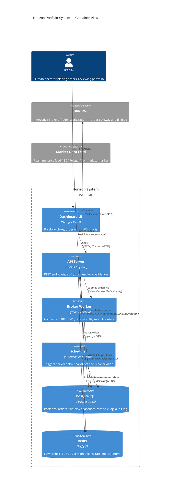
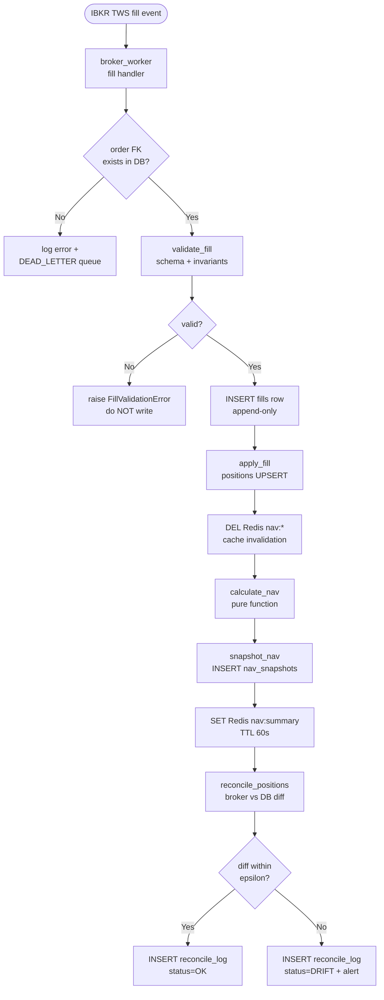
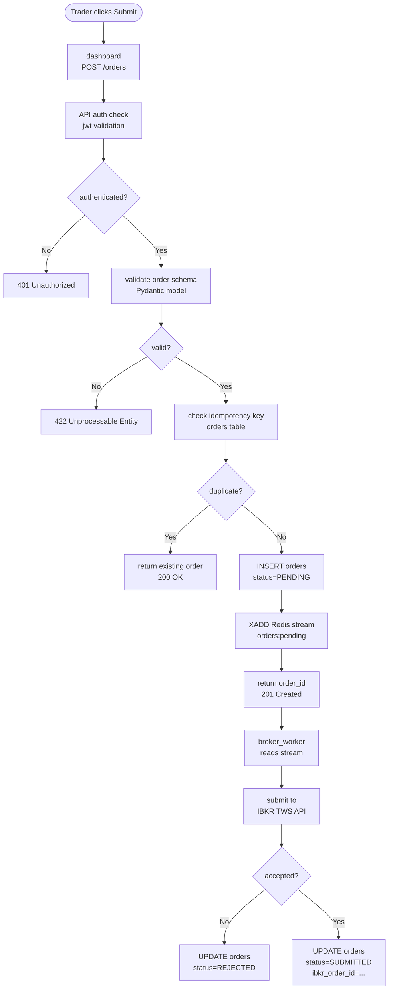

<!--
  ARCHITECTURE.md — Circuit Board Document
  Version:  1.0.0
  Date:     2026-05-04
  Session:  <replace with session id or commit SHA>
  Author:   <replace with author>

  RULE: This file is the "circuit board" of the system.
  Every connection between components is explicit here.
  When code changes, this file changes in the SAME COMMIT.
  A PR that rewires a dependency without updating this doc is a defect.
-->

# Architecture: Horizon Portfolio System

## The Circuit Board Contract

This document describes every wire between components. It is not aspirational — it reflects the code as it is committed right now. The goal is that any engineer (or agent) arriving fresh can answer "what breaks if I change X?" without grepping the entire codebase.

**If you are adding a new dependency:** add a row to the Dependency Table and an edge to the Container Diagram before merging. "I'll update the docs later" is the classic way this document rots.

---

## C4 Level 2 — Container Diagram

---

## Dependency Table

| Component | Reads from | Writes to | Called by | Breaks if changed |
|---|---|---|---|---|
| `dashboard` (Next.js pages) | `GET /portfolio/summary`, `GET /orders`, `GET /nav/history` | — (read-only UI) | Trader (browser) | Any API response shape change, any removed field |
| `GET /portfolio/summary` | `positions` table, `nav_snapshots` table, Redis `nav:summary` | Redis `nav:summary` (on miss) | `dashboard`, monitoring probes | `positions` schema, `nav_snapshots` schema, Redis key format |
| `POST /orders` | `positions` table (position check), `orders` table (idempotency key) | `orders` table, Redis stream `orders:pending` | `dashboard` | Order schema, idempotency logic, broker_worker stream format |
| `calculate_nav()` | `positions` table (all rows), market prices from Redis `price:*` | Nothing (pure computation) | `snapshot_nav()`, `GET /portfolio/summary` | `positions.quantity`, `positions.avg_cost`, price key format |
| `reconcile_positions()` | `positions` table, `fills` table, broker live state via TWS API | `reconcile_log` table, `positions` table (corrections only) | `scheduler` via `POST /internal/reconcile`, `broker_worker` on startup | Any fill schema change, `positions` primary key, broker state shape |
| `broker_worker` fill handler | IBKR TWS fill events (WebSocket), `orders` table (FK lookup) | `fills` table, `positions` table (via `apply_fill()`), Redis DEL `nav:*` | IBKR TWS push | Fill event schema from TWS, `apply_fill()` signature, `orders.ibkr_order_id` |
| `apply_fill()` | `fills` row (validated), `positions` table (upsert target) | `positions` table (INSERT ON CONFLICT DO UPDATE) | `broker_worker` fill handler | `positions` schema, decimal rounding contract, sign convention |
| `snapshot_nav()` | `calculate_nav()` result | `nav_snapshots` table (append-only INSERT), Redis `nav:summary` | `scheduler` via `POST /internal/snapshot` | `nav_snapshots` schema, append-only constraint, Redis TTL |
| `positions` table | — | `apply_fill()`, `reconcile_positions()` | `calculate_nav()`, `GET /portfolio/summary`, `reconcile_positions()` | Column renames, type changes to `quantity`/`avg_cost`/`market_value` |
| `nav_snapshots` table | — | `snapshot_nav()` only | `GET /nav/history`, `reconcile_positions()` (stale detection), monitoring | Append-only: no DELETE or UPDATE ever; schema changes break history charts |
| `reconcile_log` table | — | `reconcile_positions()` only | Audit queries, monitoring dashboards | Schema change breaks audit trail; append-only constraint |
| `audit_log` table | — | All write paths (trigger-based) | Compliance queries, incident review | Trigger logic, schema; any ALTER breaks compliance guarantee |

---

## Data Flows

### Flow A: Fill → Position → NAV Pipeline

### Flow B: Order Submission Pipeline

---

## Invariants

| ID | Invariant | Checked by | On violation |
|---|---|---|---|
| INV-01 | `nav_snapshots.total_nav == cash + sum(positions.market_value)` within ε=0.01 | `snapshot_nav()` post-condition assert | `raise InconsistentNAVError`, do NOT insert snapshot |
| INV-02 | `positions.quantity > 0` for long positions; `< 0` for short; never `0` (zero rows must be deleted) | `apply_fill()` post-condition, DB CHECK constraint | `apply_fill()` raises `ZeroPositionError`; CHECK blocks DB write |
| INV-03 | Every `fills` row has a valid FK to `orders.id` | DB FK constraint + `broker_worker` pre-insert check | FK violation = DB rejects insert; worker logs to DEAD_LETTER |
| INV-04 | `fills.quantity` aggregated per `order_id` must never exceed `orders.quantity` (no overfill) | `apply_fill()` pre-condition check | `raise OverfillError`, fill is rejected and logged |
| INV-05 | `fills.commission >= 0` (broker may return negative; must be `abs()`-normalized on ingest) | `validate_fill()` normalisation step | Any negative value after normalisation = `FillValidationError` |
| INV-06 | `nav_snapshots`, `reconcile_log`, `audit_log`, `fills` are append-only — no UPDATE or DELETE | DB triggers + migration guard rules | Trigger raises exception; migration guard blocks the migration |
| INV-07 | Redis `nav:summary` TTL must not exceed 300 s; must be invalidated on any position write | `apply_fill()` explicit `DEL nav:*` + `SET ... EX 60` in `snapshot_nav()` | Stale NAV served; detected by `reconcile_positions()` on next run |
| INV-08 | All monetary arithmetic uses `Decimal` with `ROUND_HALF_EVEN`; float is forbidden in position/NAV/fill paths | `apply_fill()` type guard, `calculate_nav()` type guard | `raise TypeError(f"Expected Decimal, got {type(v)}")` |

---

## Protected Paths

### Derived / Read-Only Columns

These columns are **computed values**. They must never be patched via direct SQL UPDATE outside the function that owns them. Patching them bypasses the invariants above and will cause silent reconcile drift.

| Column | Owner function | How it's computed |
|---|---|---|
| `positions.market_value` | `apply_fill()` + nightly mark-to-market job | `quantity × current_price` via market data |
| `positions.unrealized_pnl` | `apply_fill()` + nightly mark-to-market job | `(current_price − avg_cost) × quantity` |
| `nav_snapshots.total_nav` | `snapshot_nav()` | `calculate_nav()` result — never back-calculated |
| `orders.filled_quantity` | `broker_worker` fill aggregation | `SUM(fills.quantity) WHERE fills.order_id = orders.id` |
| `orders.avg_fill_price` | `broker_worker` fill aggregation | VWAP: `SUM(fills.quantity × fills.price) / SUM(fills.quantity)` |

### Append-Only Tables

These tables are the audit and history backbone. No migration may add `UPDATE` or `DELETE` permissions on them. No application code may issue non-INSERT DML.

| Table | Written by | Why append-only |
|---|---|---|
| `nav_snapshots` | `snapshot_nav()` | NAV history is the source of truth for performance reporting |
| `reconcile_log` | `reconcile_positions()` | Immutable record of every broker/DB comparison |
| `audit_log` | DB triggers on all write tables | Compliance and incident forensics |
| `fills` | `broker_worker` fill handler | Fill ledger; corrections done via offsetting entries, never edits |

---

## Update Log

| Date | Commit | Change description | Author |
|---|---|---|---|
| 2026-05-04 | `<sha>` | Initial architecture document — baseline for v1.0 | `<author>` |

---

<!--
  HOW TO UPDATE THIS DOCUMENT

  When you change a dependency (add a new table read, change a function signature,
  add a new component, modify a Redis key format):

  1. Update the Container Diagram edges.
  2. Update the Dependency Table row(s) affected.
  3. Update the Invariants table if any invariant is added, removed, or changed.
  4. Update the Protected Paths section if new derived columns or append-only tables are added.
  5. Add a row to the Update Log with today's date, commit SHA, and what changed.
  6. Include this file in the same commit as the code change.

  A PR that changes code wiring without updating this file fails the "circuit board" contract.
-->
